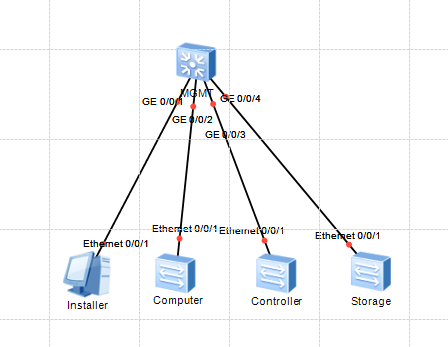
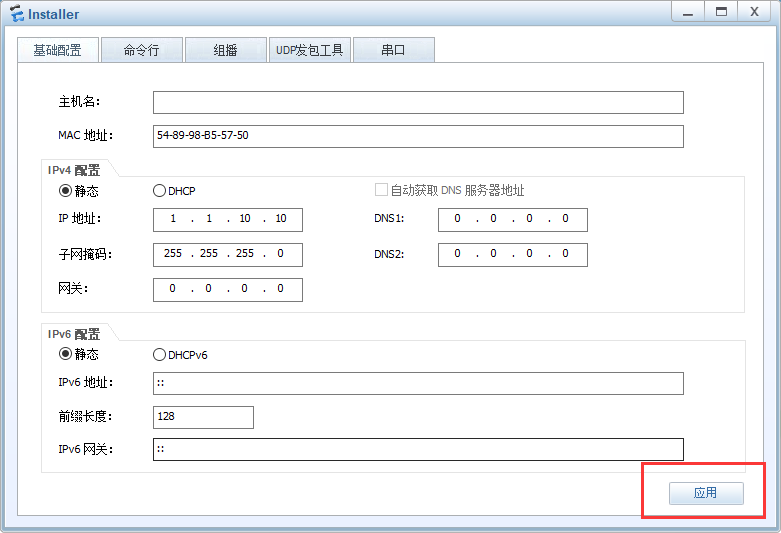

## 1.创建拓扑图

### 1.1设备选择和取名

1. 使用S5700交换机作为管理SW，取名MGMT。
2. 由于服务器只有一个端口，使用S3700代替服务器。
   1. Controller
   2. Computer
   3. Storage
3. 使用PC机，取名Installer

### 1.2端口连线

MGMT使用千兆口1~4分别连接Installer，Controller，Computer，Storage的百兆口1

## 2.配置

1. installer

2. 

## 命令说明

dis cu：查看设备所有配置

dis vlan：设备的vlan信息

dis ip int b：设备的三层口及ip简要信息

dis int b：设备接口简要信息

sys：进入视图，方括号才能编辑配置

sysname：配置名字

退出：q  或 ctrl + z

清空当前行：ctrl + x

保存：sa 或 save

dis this：查看当前配置

### vlan的配置

1. 建vlan（vlan 4092）

2. **配置二层口**（int e0/0/... port link-type...  port default vlan ...）

3. 配置三层口（可选，看具体情况）

   int vlan ...    ip address ....

   建立vlan4092的虚拟三层口，并且立即进入该口
   ip address 

### dis ip int b发现某个三层口的Physical是down

1. 该三层口所属的vlan,没有任何二层口
2. 有二层口，但，是错误的二层口
   1. 排错方式: dis vlan确认
   2. arp的请求报文是二层广播报文，且没有三层封装
   3. 其二层源mac是arp发起者，目标mac是层广播地址ff:ff:ff:ff

